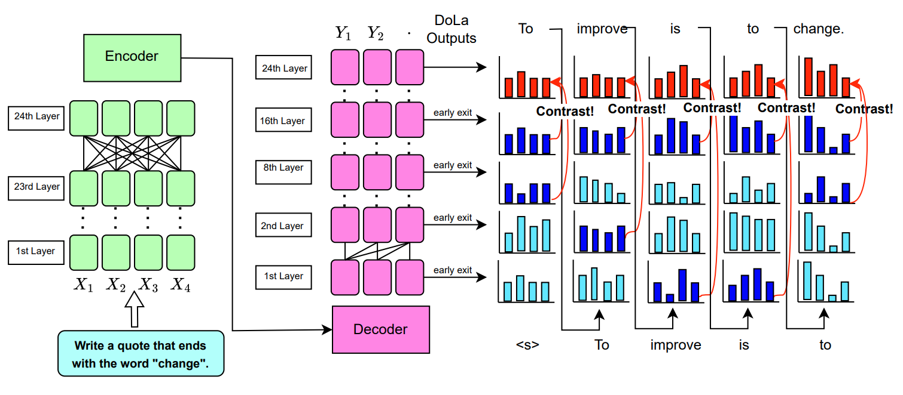

Enhancing Instruction-Following Capabilities in Seq2Seq Models: A Novel Adaptation of DoLA in T5 and FLAN-T5
===

[](https://opensource.org/licenses/MIT)
[](https://github.com/huggingface/transformers)


Code for the paper "Enhancing Instruction-Following Capabilities in Seq2Seq Models: A Novel Adaptation of DoLA in T5 and FLAN-T5"

Authors: **Huey Sun** $^\dagger$, **Lorenzo Gilly** $^\dagger$, **Anabel Yong** $^\dagger$, **Felipe Jin** $^\dagger$

$^\dagger$ University College London

## Overview



We adapted the DoLa to T5 and instruction-tuned FLAN-T5 models, and investigated how DoLa can improve keyword inclusion by analysing logit evolution through the model layers. You can upload [running_dola.ipynb](running_dola.ipynb) to Google Colab to test it out yourself.
## Setup

```
pip install -e transformers-4.28.1
pip install datasets
pip install accelerate
```

## Main Files (with Detailed Docs)

- `dola_t5.py` The class DoLaT5 is defined for working with a T5 model, supporting various generation and scoring methods, including baseline, DOLA-static, and DOLA modes. It's designed to run on either CPU or GPU, with support for multi-GPU setups.

- `ifeval_eval.py` Script to evaluate the language model's performance on ifeval. Uses the Hugging Face Transformers library to load and interact with pre-trained models. It handles different configurations and modes of operation, including parallel processing and early exit strategies for efficient inference.

- `memotrap_dataset_eval.py` Script to evaluate the performance of language models, specifically focusing on their ability to generate correct endings for given prompts. It utilizes a dataset loaded from a CSV file and supports different configurations and modes for the language model, including the use of DoLa and DoLaT5 models for improved factuality.

## Repository Structure and Key Components

- `Results:` Model outputs, evaluations of the outputs and logit analyses can be found [here](/results/)

- `Scripts and Usage:` The provided scripts are straightforward to use, requiring only the specification of the model, dataset paths, and the desired decoding strategy through command-line arguments. This design makes it easy to replicate the experiments or apply DoLA to new models and tasks.

- `Evaluation Framework:` The inclusion of evaluation scripts for specific tasks and datasets, along with instructions for using external tools for response comparison, offers a comprehensive framework for assessing the effectiveness of DoLA in enhancing the factuality of LLMs.


### Arguments

| Argument          | Example           | Description   |
| ----------------- | ----------------- | ------------- |
| `--model-name`    | `google/flan-t5-large` | Specifies the model you want to use, currently we support LLaMA-v1 and the T5 family. |
| `--data-path`     | `/path/to/dataset` | Path to the dataset file or folder. |
| `--output-path`   | `output-path.json` | Where to store the output results. |
| `--num-gpus`      | `1` | Number of GPUs to use |
| `--max_gpu_memory`| `27` | Maximum GPU memory size (in GiB) to allocate. Default: 27 (for 32G V100).  |
| `--print-logits`| | Adding this argument prints the top 5 logits in the premature layers for each token generated |

### Understanding `--early-exit-layers`

The `--early-exit-layers` argument takes a string containing a sequence of layer numbers separated by commas, with no spaces in between. By specifying different number of layers, we make the model decode at different modes.


| Number of Layers Specified  | Example (str)     | Description of Decoding Mode                                                                                     |
| ---------------------------| ------------- | ----------------------------------------------------------------------------------------------- |
| 1                          | `-1`      | **Naive decoding** from the final layer output.       |
| 2                          | `16,32`   | **DoLa-static decoding** with the second specified layer (i.e. `32`) as the `mature_layer` and first specified layer (i.e. `16`) as `premature_layer`. |
| >2                         | `0,2,4,6,8,10,12,14,32`    | **DoLa decoding** with the last specified layer (i.e. `32`) as the `mature_layer` and all the preceding layers (i.e. `0,2,4,6,8,10,12,14`) as `candidate_premature_layers`. |

### `dola_t5.py` Docs
The `dola_t5.py` script defines a class DoLaT5 for working with a T5 model, supporting various generation and scoring methods, including baseline, DOLA-static, and DOLA modes. It's designed to run on either CPU or GPU, with support for multi-GPU setups. The script is structured into several key components:

1. Initialization: The __init__ method initializes the class with model details, device configuration, and loads the model and tokenizer.

2. Model Loading: `load_model` loads the T5 model and tokenizer. It configures the model for efficient memory usage on GPUs and supports distributing the model across multiple GPUs if specified.

3. Stopping Criteria: `set_stop_words` allows setting custom stopping criteria for generation, using the T5StoppingCriteria.

4. Text Generation: The `generate` method supports text generation in three modes:

   - `baseline`: Standard text generation.

   - `dola-static`: Uses specified mature and premature layers for DOLA decoding.

   - `dola`: Dynamically selects the premature layer based on divergence from the mature layer's output.

   It supports various generation parameters like `max_new_tokens, top_p, top_k`, and `temperature`. The method can also remove specified stop words from the output.

5. Relative Top Filtering: `get_relative_top_filter` is a utility for applying a relative top filter based on the scores' softmax values, used in DOLA modes for filtering logits.

6. Language Modeling Score: `lm_score` calculates the language modeling score for a given text, supporting the same three modes as text generation. It can compute scores based on the difference in logits between layers (for DOLA modes) and supports PMI calculation.

7. Utility Methods: The script includes methods for softmax normalization, KL divergence calculation, and JS divergence calculation for selecting the premature layer in DOLA mode.

Key functionalities include:

   - DOLA Decoding: Dynamically selects layers for decoding based on divergence, aiming to improve generation quality.

   - Efficient Memory Usage: Configures the model for low memory usage on CPUs and efficient distribution across multiple GPUs.

   - Custom Stopping Criteria: Allows specifying custom stopping words for generation tasks.

### IfEval
The input prompts can be found in [data/ifeval-input-data.jsonl](data/ifeval-input-data.jsonl). Further instructions for analyzing model output can be found in evaluation/IfEval

#### Baseline
```bash
python ifeval_eval.py --model-name google/flan-t5-small --data-path ./data/ --output-path output-path.json --num-gpus 1
python ifeval_eval.py --model-name google/flan-t5-base --data-path ./data/ --output-path output-path.json --num-gpus 1
python ifeval_eval.py --model-name google/flan-t5-large --data-path ./data/ --output-path output-path.json --num-gpus 1
python ifeval_eval.py --model-name google/flan-t5-xl --data-path ./data/ --output-path output-path.json --num-gpus 1
```

#### DoLa
```bash
python ifeval_eval.py --model-name google/flan-t5-small --early-exit-layers 0,2,4,6,8 --data-path ./data/ --output-path output-path.json --num-gpus 1
python ifeval_eval.py --model-name google/flan-t5-base --early-exit-layers 0,2,4,6,8,10,12 --data-path ./data/ --output-path output-path.json --num-gpus 1
python ifeval_eval.py --model-name google/flan-t5-large --early-exit-layers 0,2,4,6,8,10,12,14,16,18,20,22,24 --data-path ./data/--output-path output-path.json --num-gpus 1
python ifeval_eval.py --model-name google/flan-t5-xl --early-exit-layers 0,2,4,6,8,10,12,14,16,18,20,22,24 --data-path ./data/ --output-path output-path.json --num-gpus 1
```

#### `ifeval_eval.py` Docs
Script to evaluate the language model's performance on a given dataset. Uses the Hugging Face Transformers library to load and interact with pre-trained models. It handles different configurations and modes of operation, including parallel processing and early exit strategies for efficient inference.

It is structured as follows:

1. **Imports and Setup**: The script imports necessary libraries and sets up regular expressions and constants. It suppresses logging messages from the Transformers library to reduce clutter.

2. **Functions**:

   - load_jsonl(file_path): Loads a JSONL file and returns a list of prompts extracted from it.

   - create_demo_text(): Creates a demonstration text with questions and answers to be prepended to the input prompts.

   - build_prompt(input_text): Builds the final prompt by appending the input text to the demonstration text.

3. **Argument Parsing**: The script uses argparse to parse command-line arguments, allowing users to specify the model name, device, data path, and other configurations.

4. **Data Preparation**: It loads the dataset from a specified path and optionally limits the number of prompts for debugging or splits the dataset for parallel processing.

5. **Model Initialization**: Depending on the model name, it initializes either DoLa or DoLaT5 class, which are presumably custom classes for handling language model inference. The script sets stop words to signal the end of a generation.

6. **Early Exit Layers Configuration**: It configures early exit layers for the model, which is a technique to improve inference efficiency by exiting the model's forward pass early under certain conditions. The script supports three modes:

   - baseline: Standard decoding without early exit.

   - early_exit_contrastive: Uses a specific mature and premature layer for early exit.

   - dola: Dynamically chooses from a set of candidate premature layers based on certain criteria.

7. **Inference Loop**: For each prompt in the dataset, the script:

   - Builds the full prompt using build_prompt.

   - Generates a completion using the model with specified generation parameters.

   - Cleans up the generated text by removing stop words.

   - Optionally, tracks the usage of premature layers in dola mode.

   - Results Handling: The script collects the prompts and their corresponding model completions in a list of dictionaries.

8. **Output**: Finally, it saves the results to a JSONL file in the specified output path. If parallel processing is enabled, it appends the shard ID to the output filename.

### Memo Trap
The input prompts can be found in [data/memotrap-input-data.jsonl](data/memotrap-input-data.jsonl). Further instructions for analyzing model output can be found in evaluation/MemoTrap

#### Baseline
```bash
python memo_trap_eval.py --model-name google/flan-t5-small --data-path ./data/ --output-path output-path.json --num-gpus 1
python memo_trap_eval.py --model-name google/flan-t5-base --data-path ./data/ --output-path output-path.json --num-gpus 1
python memo_trap_eval.py --model-name google/flan-t5-large --data-path ./data/ --output-path output-path.json --num-gpus 1
python memo_trap_eval.py--model-name google/flan-t5-xl --data-path ./data/ --output-path output-path.json --num-gpus 1
```

#### DoLa
```bash
python memo_trap_eval.py --model-name google/flan-t5-small --early-exit-layers 0,2,4,6,8 --data-path ./data/ --output-path output-path.json --num-gpus 1
python memo_trap_eval.py--model-name google/flan-t5-base --early-exit-layers 0,2,4,6,8,10,12 --data-path ./data/ --output-path output-path.json --num-gpus 1
python memo_trap_eval.py --model-name google/flan-t5-large --early-exit-layers 0,2,4,6,8,10,12,14,16,18,20,22,24 --data-path ./data/ --output-path output-path.json --num-gpus 1
python memo_trap_eval.py --model-name google/flan-t5-xl --early-exit-layers 0,2,4,6,8,10,12,14,16,18,20,22,24 --data-path ./data/ --output-path output-path.json --num-gpus 1
```

#### `memotrap_dataset_eval.py` Docs
Script to evaluate the performance of language models, specifically focusing on their ability to generate correct endings for given prompts. It utilizes a dataset loaded from a CSV file and supports different configurations and modes for the language model, including the use of DoLa and DoLaT5 models for improved factuality.

1. Imports and Initial Setup: The script imports necessary libraries and sets up logging and constants. It defines regular expressions for parsing answers and initializes flags for debugging and other configurations.

2. Utility Functions:

   - parse_classes: Parses a string representation of a list into an actual list of strings.

   - load_csv: Loads data from a CSV file, parsing each line into a dictionary with keys for the prompt, possible classes (answers), and the correct answer index.

   - extract_and_compare_answer: Extracts the model's generated answer ending and compares it with the correct answer to determine correctness.

   - create_demo_text: Generates a demo text with example questions and answers to be used in the prompt construction.

   - build_prompt: Constructs the input prompt for the model by appending the demo text and the specific question to be answered.

3. Argument Parsing: The script uses argparse to handle command-line arguments for model configuration, dataset paths, and evaluation settings.

4. Model Selection and Configuration: Based on the provided model name, the script selects between the DoLa and DoLaT5 models. It also sets up model-specific configurations like stop words, early exit layers, and repetition penalties.

5. Data Preparation: The script loads the dataset from a CSV file. It supports debugging mode (which limits the data to the first 10 samples) and parallel processing mode (which divides the dataset into chunks based on shard IDs).

6. Evaluation Loop:

   - For each sample in the dataset, it constructs the input prompt and generates model completions based on the provided arguments.

   - It then cleans the model completion by removing any stop words and trims whitespace.

   - The script extracts the model's answer ending and compares it with the correct answer to determine correctness.

   - It accumulates results, including the model's completions, the generated answer endings, the correct answers, and correctness flags.

7. Results Reporting and Saving:

   - Calculates the overall accuracy of the model based on the correctness flags.

   - In "dola" mode with debugging enabled, it reports the usage statistics of premature layers.

   - Saves the evaluation results to a JSON file, with the filename optionally including the shard ID for parallel processing setups.

## Reference Repositories
- DoLa: https://github.com/voidism/DoLa
- IfEval: https://huggingface.co/datasets/HuggingFaceH4/ifeval
- Memo Trap: https://github.com/liujch1998/memo-trap
- FLAN: https://huggingface.co/docs/transformers/en/model_doc/flan-t5